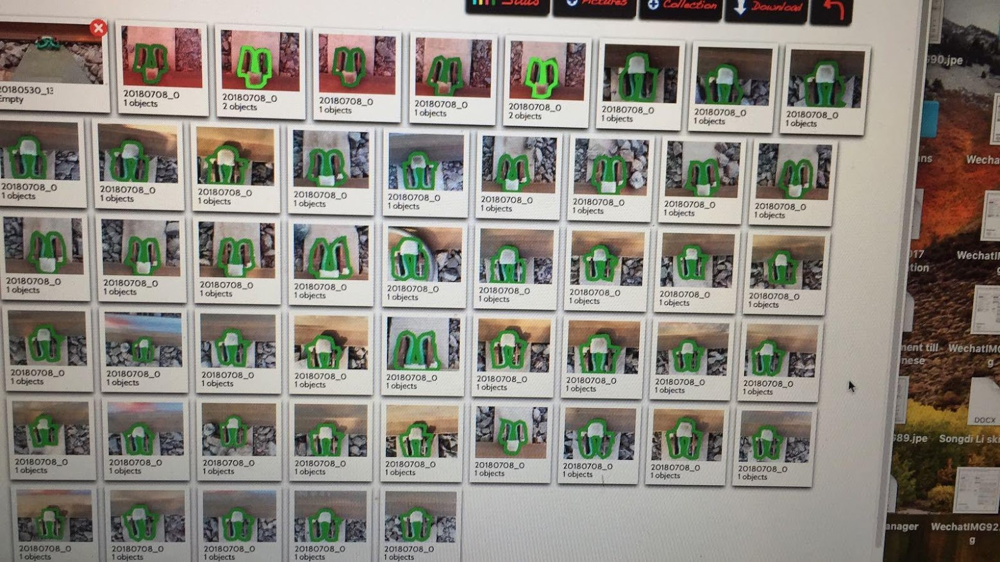
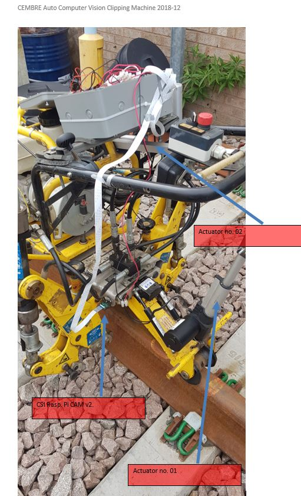
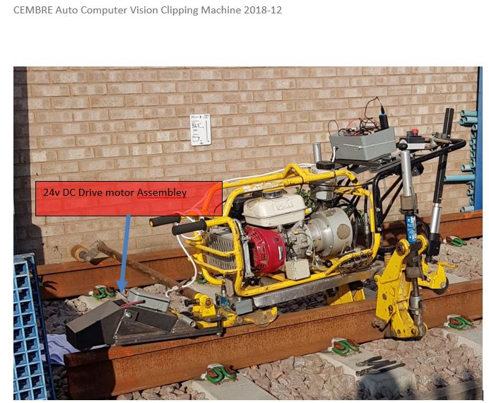

# Railclippingcomputervision

## Raspberry Pi + intel movidius powered automatic clipping machine code for controlling Cembre Fastclip Clipping

_This project was done in 2018 December and testing completed in April 2019. The aim of the project was to:_ 

**1. Train a CNN custom object detection model (Mobilenet) with library of circa 1000 real site Fasclip photos.**

**2. Fully automate Cembre Fast Clip type clipping machine using a CSI Camera input into Raspberry pi with Intel Movidius first gen. chip acting as GPU.**

### Training Data library and Annotations

### Auto Clipping Machine Assembley -BACK -  Actuators and Camera Location

### Auto Clipping Machine Assembley -FRONT - DC Drive Motors

### Video Repositories
[**1. Gathering data - track clips**](https://youtu.be/IrTTT1wQgpsE)

[**2. De-bugging bot with iterative camera positions**](https://youtu.be/BeFUDPnRAoE)

[**3. Voila ! Fully Automated Clipping machine using CSI Camera - 2019-April-01**](https://youtu.be/jqsyzdLeAmE)

There were 2 x actuators installed on the retrofitted Clipping machine
1. No.01 24v DC actuator was to give up and down motion between the clips as done by human operator
2. No.02 24v DC actuator was to give the 4-stroke engine throttle control to control the pressure going to the hydraulic system.
3. A custom 24V DC motor rail traction assembley was fabricated to provide front back motion between the clips.

On detecting a clip, the process flow in programme in Python were:

1. Detect Clip in centre of detection frame box (Fastclip/ with centre on housing).
2. Stop the forward/ backward motion (GPIO output to H Bridge)
3. Activate No.01 Actuator to lower the clipping RAMS on top of the housing.
4. Timer on step no. 03 was fine tuned to reach travel distance.
5. Activate No.02 actuator to increase hydraulic pressure to perform Clipping or Unclipping operation as required.
6. Once operation complete in step 5, step 4 and step 3 were carried out in reverse to lift the clipping machine back to travel position
7. Once step 6 complete (limit switch) engage the H bridge to engage DC motor forward motion.

#### Special Thanks to Dr. Robail Yasrab for his guidance in 2018, without him, this wouldnt have been possible
>https://www.linkedin.com/in/dr-robail-yasrab-578a0127/

please refer attached photos and videos and feel free to message me here for any queries swamy.dce@gmail.com

thanks,

